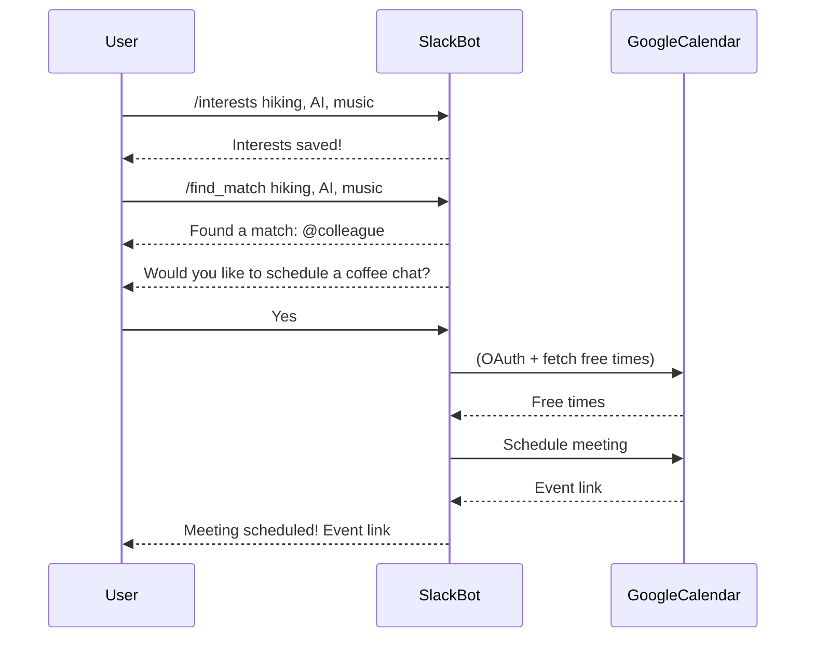

# Social AI Slack Bot MVP

## Overview

**Social AI** is a Slack bot that helps connect people in a workspace by matching users with similar interests and automatically scheduling coffee chats or meetings between them. The bot leverages user-provided interests and (in production) integrates with Google Calendar to find the best meeting times, making workplace networking seamless and fun.

---

## How It Works

1. **Set Your Interests:**
   - Use the `/interests` command to tell the bot what you like (e.g., `/interests hiking, AI, music`).
2. **Find a Match:**
   - Use the `/find_match` command to discover colleagues with similar interests.
3. **Schedule a Meeting:**
   - The bot suggests a match and (in production) helps you schedule a meeting by integrating with your Google Calendar.

---

## Example Workflow



---

## Setup Instructions

1. **Clone the repo**
2. **Install dependencies:**
   ```bash
   pip install -r requirements.txt
   ```
3. **Create a Slack App:**
   - Go to https://api.slack.com/apps
   - Add bot token and signing secret to your environment variables or `.env` file
4. **(Optional for production) Set up Google Calendar API:**
   - Create a project in Google Cloud Console
   - Enable Google Calendar API
   - Download OAuth credentials and save as `credentials.json`
5. **Create a `.env` file:**
   ```env
   SLACK_BOT_TOKEN=your-bot-token-here
   SLACK_SIGNING_SECRET=your-signing-secret-here
   SLACK_CLIENT_ID=your-client-id
   SLACK_CLIENT_SECRET=your-client-secret
   ```
6. **Run the bot:**
   ```bash
   python3 app.py
   ```
7. **Expose your local server to Slack (for development):**
   ```bash
   ngrok http 3000
   ```
   - Use the generated ngrok URL for your Slack app's Request URL (e.g., `https://your-ngrok-url.ngrok-free.app/slack/events`)

---

## Commands

- `/interests [your interests]` — Set your interests (comma-separated)
- `/find_match [your interests]` — Find and connect with similar people

---

## Notes
- This MVP uses mocked database and calendar logic for demonstration.
- In production, real Google Calendar integration and persistent storage are recommended.

---

## Contributing & Ideas
- Suggest new features, such as group events, icebreaker questions, or feedback after meetings!
- PRs and issues welcome. 